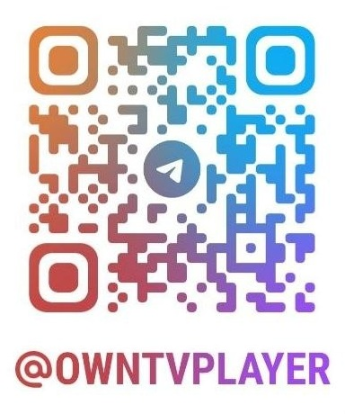
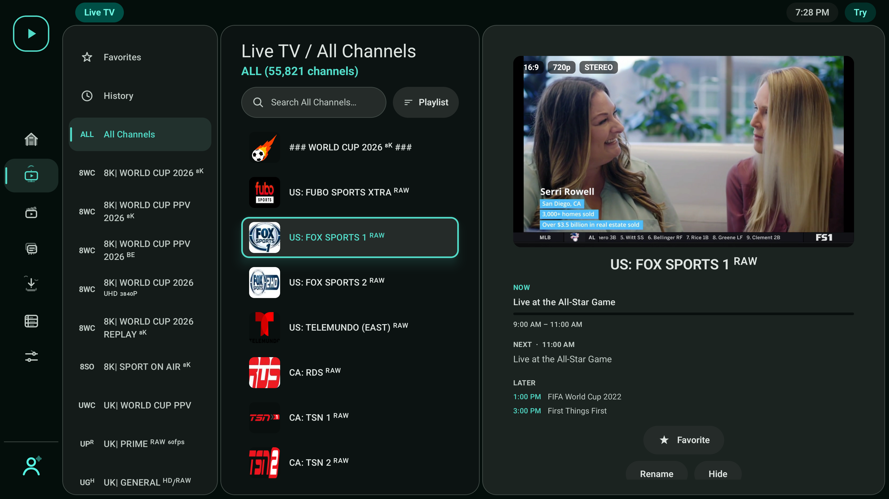
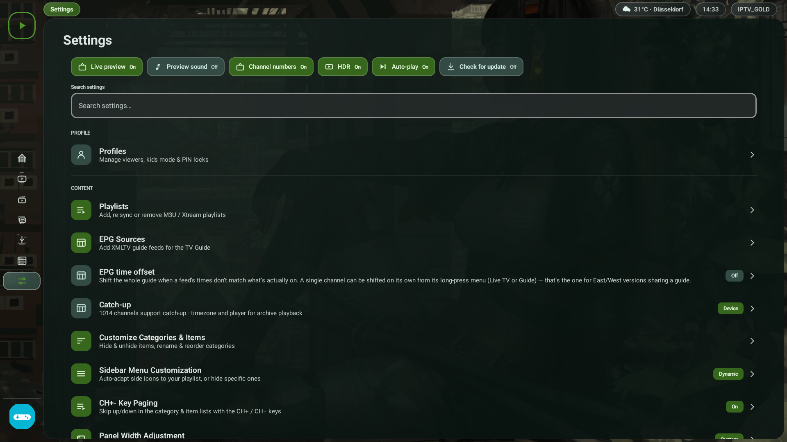

<p align="center">
  
</p>

<p align="center">
  <b>Your own IPTV player for Android TV</b><br>
  <sub>Fast · modern · remote-first — bring your own M3U, Xtream or Stalker (MAC) sources</sub>
</p>

<p align="center">
  
  
  
  
  
  
  <a href="https://hosted.weblate.org/engage/owntv/">
    
  </a>
</p>

<p align="center">
  <a href="https://github.com/ahXN00/OwnTV/actions/workflows/android.yml">
    
  </a>
</p>

---
OwnTV is a native **Android TV** IPTV **player**, built with Kotlin and Jetpack Compose for TV. It
runs **two playback engines** — libmpv (FFmpeg) for the widest compatibility, ExoPlayer (Media3) for
near-instant Live TV — and it is a *player only*: you bring your own **Xtream** login, **M3U**
playlist (URL or a local file) or **Stalker/Ministra** portal.

> ⚠️ OwnTV ships **no** channels, playlists, subscriptions or streams. You are responsible for the
> sources you add.

Open source, GPLv3, original code, built with the help of AI. **Android TV only** — leanback
launcher, D-pad first.

> ### 📖 New here? **[User Guide →](extras/USER_GUIDE.md)**
> Every feature, where to find it, and the remote shortcuts — on one page.

---

## 💬 Community

Questions, ideas, bug reports — **join the OwnTV Telegram group:**

### 👉 [t.me/owntvplayer](https://t.me/owntvplayer)

<a href="https://t.me/owntvplayer"></a>

---

## ✨ Features

### 🎬 Playback
- **Two engines** — mpv for compatibility, ExoPlayer for instant Live TV, with automatic fallback and a per-channel override
- **4K HDR** direct rendering, optional auto frame-rate matching, surround sound with a stereo safety net, 150% volume boost
- **Subtitles** — text, image and closed captions, plus OpenSubtitles search and local files
- Resume, next-episode auto-play, mini-player/PiP, audio-only mode, live stream-info overlay
- Media-session transport keys and proper audio focus — it behaves like a TV app
- An **error log you can export** for any stream that misbehaves

### 🧭 Browse
- **Home** with Continue Watching and **Now Trending** (TMDB rankings matched to what your provider can actually play)
- Live TV · Movies · Series · Downloads · Guide, with per-profile row order, Favorites, History and search
- **Multiple playlists** at once, with provider labels everywhere they could be confused
- Rename, hide, reorder and combine categories; bulk rename rules
- **TMDB** posters, plots, cast and trailers in 40 languages — scales to ~50k channels / ~168k movies
- Adjustable panel widths per section, including hiding the preview pane entirely

### 📥 Sources & EPG
- **Xtream**, **M3U** and **Stalker/Ministra** — add any of them from your phone over Wi-Fi (QR + PIN)
- **TV Guide** (XMLTV) with a live Now marker, multiple guide sources and automatic channel matching
- **Catch-up TV** up to 7 days, live rewind, and *Go back to…* even for channels with no guide
- Guide time offset, per-source guide logos, per-channel EPG fixes
- **Protected (DRM) channels** — Widevine and ClearKey, read from the playlist, nothing to configure
- Custom **DNS** (Google, Cloudflare, Quad9, DoH or your own)

### ⏺️ Recording & Multiview
- Record live TV from the guide, the channel list or while watching — including every showing of a programme
- **Multiview** — up to four channels at once, with one carrying the sound
- OwnTV measures how many streams your provider allows and warns before it refuses one

### 👥 Profiles & Downloads
- Multiple profiles with their own favourites, history and resume points, PIN locks and a Kids mode
- Per-profile startup: Home, last channel, Favorites, or one chosen channel
- Offline movies and episodes with pause, resume, retry and a storage bar

### 🎨 Look & robustness
- Material 3 theming, your own accent and focus highlight, and an interaction-aware **Glass Effect**
- Font sizing for the interface and for popups, independently
- **Remote Shortcuts** — map spare colour, number, channel and media keys to 25 actions
- **26 interface languages**, RTL-aware, chosen before anything else on a fresh install
- **Backup & Restore** to a single `.own` file, optionally encrypted, locally or over Wi-Fi
- In-app updates; memory-safe lists, auto-reconnect and offline detection throughout

---

## 📸 Screenshots

<table>
  <tr>
    <td align="center"><br><sub>Home — Continue Watching</sub></td>
    <td align="center"><br><sub>Live TV — preview playing</sub></td>
  </tr>
  <tr>
    <td align="center"><br><sub>TV Guide (EPG)</sub></td>
    <td align="center"><br><sub>Settings</sub></td>
  </tr>
</table>

More in **[extras/screenshots/](extras/screenshots/)**.

---

## 🧱 Tech stack

| Area | Choice |
|------|--------|
| Language | Kotlin 2.4.20 (no `kotlin-android` plugin) |
| Build | AGP 9.4.0 / Gradle 9.7.1, KSP2 2.3.11 |
| UI | Jetpack Compose for TV (`androidx.tv:tv-material` 1.1.0), Compose BOM 2026.08.00 |
| Media | **libmpv** (FFmpeg) · **ExoPlayer/Media3** 1.11.1 |
| Database | Room 2.8.5 + Paging 3.5.1 + FTS4 |
| DI · Network · Images | Koin 4.2.2 · OkHttp 5 · Coil 3.6.0 |

`minSdk 26`, `targetSdk 36`, `compileSdk 37`, `applicationId tv.own.owntv`.

> **Build note:** there is no `kotlin-android` plugin. AGP 9 ships its own Kotlin, but the Compose
> compiler plugin pulls the Kotlin Gradle plugin up to the `kotlin` version in
> `gradle/libs.versions.toml` — that is what compiles the app, so keep the Compose compiler plugin on
> exactly that version. KSP versions independently and does not have to match it.

## ⚙️ How it works

- **Parsing & sync** — M3U is line-streamed and Xtream JSON is read with `JsonReader`, so a huge
  provider payload is never fully buffered. Refresh is chunked, cancellable and reports progress.
- **Storage** — a 27-entity Room schema with FTS4 search; Paging 3 with a bounded size keeps memory
  flat across 50k-item lists.
- **EPG** — XMLTV is stream-parsed (gzip-aware) into a rolling window and pruned.
- **Player** — two engines behind one `PlaybackEngine` interface, with a four-rung fallback ladder.
  Live promotes the running preview straight to full screen with no reload.
- **DI** — Koin modules.

### Project layout

This repository is the **Android TV app**. Everything underneath it — database, sync, parsers, EPG,
backup, settings storage, the playback engines and every translated string — is a separate core
library, shared with the mobile app.

```
OwnTV/  (this repo)
tv.own.owntv/
├── player/      the TV player HUD, surfaces and mini-player
├── ui/          theme + reusable components
├── features/    setup, shell, live, movies, series, search, downloads, epg, profiles, settings
└── di/          Koin modules

OwnTV_Core/  (separate repo, published as tv.own.owntv:core / :player-core)
├── core/        database, network, parsers, Stalker, repository, sync, strings
└── player-core/ libmpv + ExoPlayer engines, fallback ladder, watchdogs, diagnostics
```

## 📚 Docs (`extras/`)

- 📖 **[User Guide](extras/USER_GUIDE.md)** — every feature and where to find it.
- 📄 **[Master Product Brief](extras/OwnTV_Master_Product_Brief.md)** — the full as-built feature and
  architecture reference.
- 📺 **[Player design reference](extras/player.html)** — an interactive mockup of the player UI.

## 📥 Installing (Fire TV / Android TV)

Grab the signed APK from the [**latest release**](https://github.com/ahXN00/OwnTV/releases/latest).
This link always points at the newest build:

```
https://github.com/ahXN00/OwnTV/releases/latest/download/OwnTV.apk
```

- **Fire TV** — install **Downloader** (by AFTVnews), then enter code **`4308278`**. Enable *Apps from
  Unknown Sources* if prompted.
- **Android TV / Google TV** — Downloader is on Google Play too, so the same code works. Or sideload
  with *Send files to TV*, a USB drive, or `adb install OwnTV.apk`.

> Install only from this repository's Releases. Each release ships **two APKs**:
> `OwnTV.apk` (arm — every real TV box, and what the Downloader code fetches) and
> `OwnTV-x86_64-vX.X.X.apk` (emulators and rare Intel boxes).

## 🛠️ Building & running

> Only if you want to build from source — otherwise just
> **[install the APK](#-installing-fire-tv--android-tv)**.

**One extra step first: a GitHub token.** Half the app lives in the separate
[OwnTV_Core](https://github.com/ahXN00/OwnTV_Core) repository and is pulled from GitHub Packages,
which always asks who you are. Without it, Gradle sync fails with a `401`.

1. **Get the code** — `git clone https://github.com/ahXN00/OwnTV.git` (or download the ZIP).
2. **Add a token** — create a [personal access token (classic)](https://github.com/settings/tokens)
   with the single scope **`read:packages`**, then put it in `~/.gradle/gradle.properties`
   (`C:\Users\<you>\.gradle\gradle.properties`) — never inside the project:
   ```properties
   gpr.user=your-github-username
   gpr.token=ghp_yourtokenhere
   ```
3. **Open it** in [Android Studio](https://developer.android.com/studio) and let Gradle sync.
4. **Pick the build variant** — `standard` for real devices and arm emulators, `x86_64` for x86_64
   emulators. This matters: the native player only loads on a matching ABI.
5. **Run** ▶. Minimum **Android 8.0 / API 26**.

Command line: `./gradlew assembleDebug` (`gradlew.bat` on Windows). The APK lands in
`app/build/outputs/apk/`.

**Tested on** a real TCL Google TV and the Android Studio emulator (Android TV and Google TV images).

## 🤝 Contributing

Contributions, bug reports and ideas are welcome — open an issue or a pull request. Please keep the
project's player-only, bring-your-own-source positioning and match the existing code style.

<!-- i18n-contribution:start -->
## Help translate OwnTV

If your language is already available, contribute interface translations across OwnTV's six Android resource components on [Hosted Weblate](https://hosted.weblate.org/projects/owntv/). If it is not listed, [open a language request ticket](https://github.com/ahXN00/OwnTV/issues/new?template=feature_request.yml&title=%5BLanguage%5D%20Add%20) first. A maintainer will review the request, register the locale, and prepare its base translation files on Hosted Weblate. Once the language appears on Hosted Weblate, you can start translating it there. The strings themselves live in [OwnTV's core library repository](https://github.com/ahXN00/OwnTV_Core), together with the language contributor guide covering identifiers, validation, and promotion policy.
<!-- i18n-contribution:end -->

## 🙏 Credits


OwnTV speaks 26 languages because people translate it on
[**Weblate**](https://weblate.org/), which hosts the project free of charge for libre software.
Thank you to Weblate and to every translator who has given the app their language.


Movie & series metadata and trailers are provided by [TMDB](https://www.themoviedb.org/).
**This product uses the TMDB API but is not endorsed or certified by TMDB.**


Subtitle search & download is powered by [OpenSubtitles.com](https://www.opensubtitles.com/).
**This product uses the OpenSubtitles API but is not endorsed or certified by OpenSubtitles.** You sign
in with your own OpenSubtitles account and are subject to their terms and download quotas.

### ▶️ Playback engines

- **[mpv](https://mpv.io/)** (via [libmpv](https://github.com/mpv-android/mpv-android), built on
  [FFmpeg](https://ffmpeg.org/)) — the default engine, for the widest IPTV/codec, audio and HDR support.
- **[Media3 / ExoPlayer](https://github.com/androidx/media)** — the fast-start engine for Live TV
  preview and HLS.

Which of the two starts a stream is yours to set, separately for Live TV and for Movies & Series
(Settings → Video Player): either order, or one engine only with the automatic handover turned off.

### 🧩 Built with

[Jetpack Compose for TV](https://developer.android.com/jetpack/compose) ·
[Room](https://developer.android.com/jetpack/androidx/releases/room) ·
[Koin](https://insert-koin.io/) ·
[OkHttp](https://square.github.io/okhttp/) ·
[Coil](https://coil-kt.github.io/coil/) ·
[ZXing](https://github.com/zxing/zxing) — and the wider Kotlin / AndroidX open-source ecosystem.
Thank you to all their maintainers. See each project for its own license.

## ⚖️ Legal

OwnTV is a media **player** only. It ships with no channels, playlists, subscriptions, or content, and
does not endorse or facilitate access to unauthorized streams. Users are solely responsible for the
sources they add and for complying with the laws and rights that apply to them.

## 📄 License

Released under the **GNU General Public License v3.0 (GPLv3)** — see [LICENSE](LICENSE).

In short: you're free to use, study, modify, and redistribute OwnTV, including commercially — but any
redistributed version (including forks and commercial products built on it) must also be licensed under
GPLv3 and its source made available.

---

<sub>OwnTV is an open-source, player-only project, built with the help of AI.</sub>
